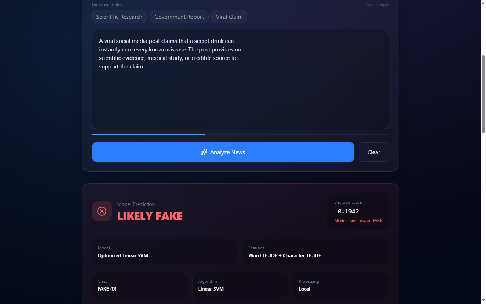
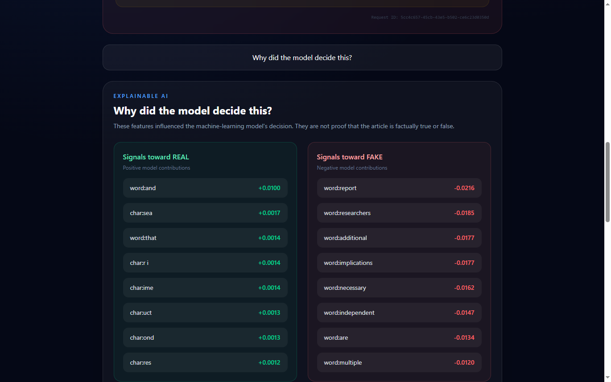
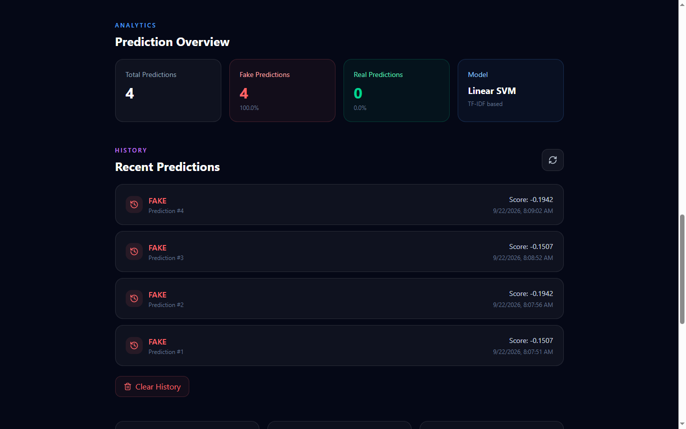
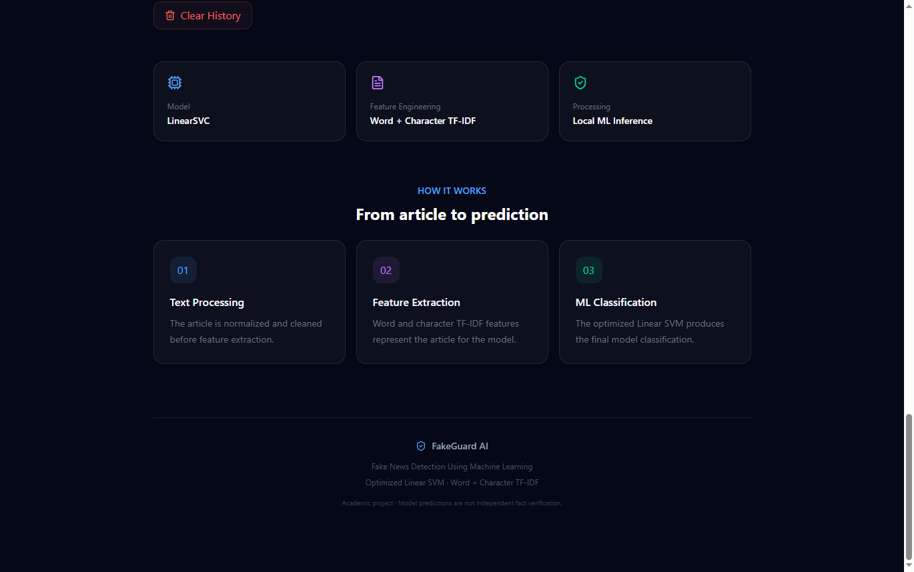
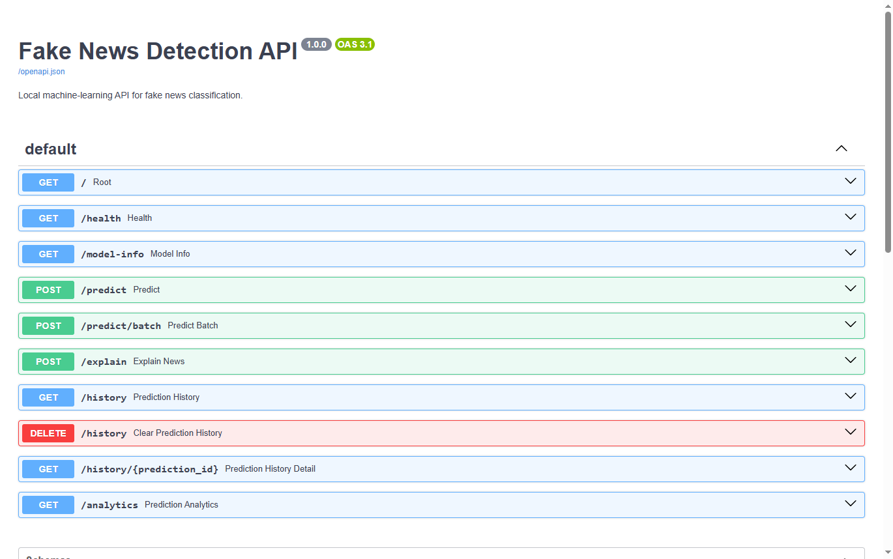
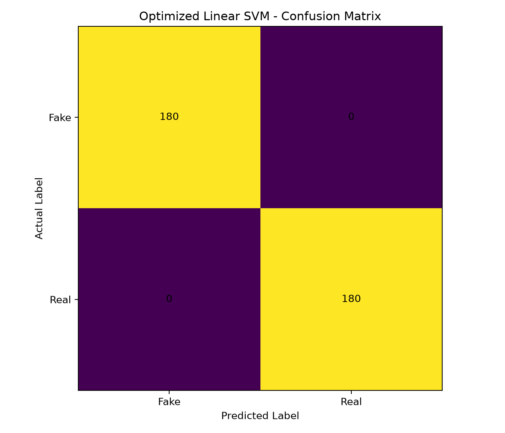
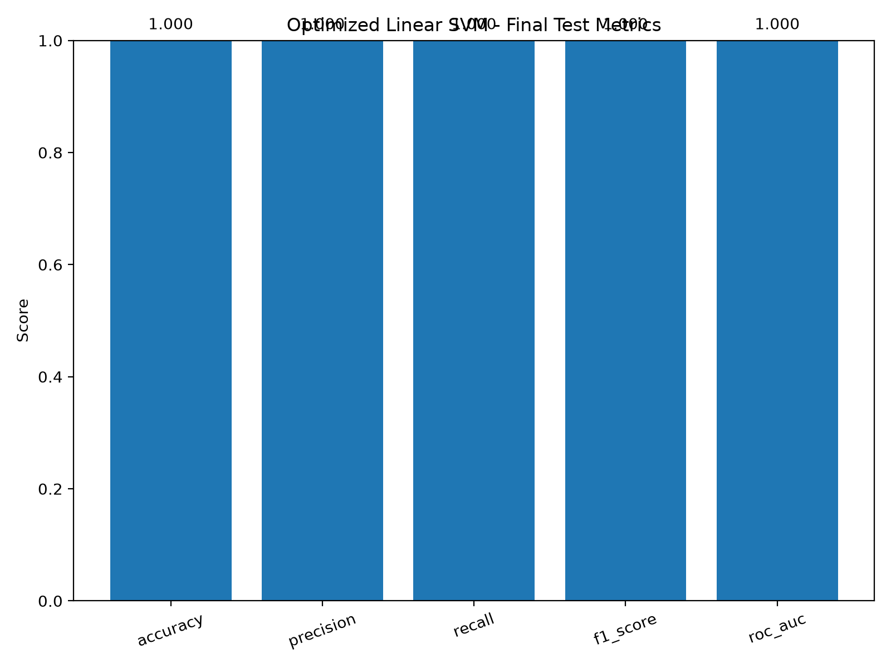

# 🛡️ FakeGuard AI

## Fake News Detection Using Machine Learning

[](https://python.org)
[](https://fastapi.tiangolo.com)
[](https://react.dev)
[](https://vitejs.dev)
[](https://tailwindcss.com)
[](https://scikit-learn.org)
[](https://pytest.org)
[](https://opensource.org/licenses/MIT)

**FakeGuard AI** is an end-to-end, production-style machine learning web application that classifies news articles as **REAL** or **FAKE** using Natural Language Processing (NLP) and an optimized Linear Support Vector Machine (Linear SVM). Designed for high-speed local and offline deployment, FakeGuard AI features explainable AI (XAI), persistent prediction history, analytics tracking, and automated testing suites.

---

## ✨ Features

- **Binary News Classification**: Predicts whether a news article is likely `REAL` or `FAKE` with high accuracy.
- **Hybrid TF-IDF Vectorization**: Combines Word n-grams (1-2) with Character n-grams (3-5) to capture both semantic tone and orthographic patterns.
- **Optimized Linear SVM**: Hyperparameter-tuned linear classifier optimized for sparse high-dimensional feature spaces, delivering sub-10ms inference.
- **Explainable AI (XAI)**: Visualizes top weighted features that influenced the model's decision for transparent analysis.
- **Full History & Analytics**: SQLite-backed audit trail of predictions with real-time distribution metrics and analytics.
- **FastAPI REST Backend**: High-performance asynchronous API with input sanitization, in-memory caching, security headers, and request tracking.
- **Modern React Interface**: Glassmorphic dark-mode UI built with React 19, Vite, and Tailwind CSS.
- **Comprehensive Testing Suite**: Unit, integration, regression, and performance tests with 84%+ coverage.
- **Windows Deployment Ready**: One-click startup scripts and PyInstaller standalone specification.

---

## 🧠 Machine Learning Methodology

The machine learning pipeline follows a strict, leak-free preprocessing and evaluation workflow:

```text
Raw Text Input
      │
      ▼
Text Normalization (Unicode, Whitespace, URLs, Emails, Repeats)
      │
      ▼
Dual Feature Extraction (Word TF-IDF + Subword Character TF-IDF)
      │
      ▼
Feature Union (Sparse Matrix Representation)
      │
      ▼
Optimized Linear SVM (C=1.0, L2 penalty, Hinge loss)
      │
      ▼
Prediction (REAL / FAKE) + Calibrated Decision Margin Score
      │
      ▼
Feature Attribution (Top Positive / Negative Model Weights)
```

---

## 🏗️ System Architecture

```text
┌───────────────────────────────────────────────────────────┐
│                 React 19 Frontend (Vite)                  │
│       • Live Status  • Article Input  • History Table     │
│       • Confidence Gauge  • XAI Feature Inspection        │
└─────────────────────────────┬─────────────────────────────┘
                              │ HTTP / REST (JSON)
                              ▼
┌───────────────────────────────────────────────────────────┐
│                  FastAPI Backend Server                   │
│  • Request ID Middleware     • Security Headers           │
│  • Input Length & Null-byte Sanitization  • MD5 Caching   │
└──────────────┬─────────────────────────────┬──────────────┘
               │                             │
               ▼                             ▼
┌──────────────────────────────┐ ┌──────────────────────────┐
│     Inference & XAI Core     │ │     SQLite Database      │
│  • Text Cleaning             │ │  • Predictions History   │
│  • Feature Extractor         │ │  • Aggregate Analytics   │
│  • Linear SVM Model          │ └──────────────────────────┘
│  • Decision Margins & XAI    │
└──────────────────────────────┘
```

---

## 🛠️ Technology Stack

### Frontend
- **React 19** — Interactive component-driven UI
- **Vite 8** — Fast modern build tooling
- **Tailwind CSS v4** — Dark-mode glassmorphic styling
- **Axios** — HTTP client for API communications
- **Lucide React** — Crisp icon system

### Backend
- **Python 3.14 / 3.11+** — Core programming language
- **FastAPI** — High-performance modern web framework
- **Uvicorn** — ASGI production server
- **Pydantic v2** — Data validation and strict settings management
- **SQLAlchemy** — ORM for structured database operations

### Machine Learning
- **Scikit-learn** — TF-IDF vectorizers and Linear SVM classifier
- **NumPy & SciPy** — Efficient sparse matrix calculations
- **Joblib** — High-performance model serialization

### Database & Storage
- **SQLite** — Embedded relational database for zero-config persistence

### Testing & Quality Assurance
- **Pytest** — Comprehensive unit, integration, and regression test runner
- **Pytest-cov** — Automated test coverage reporting

---

## 📸 Screenshots

### Home Page


### Article Input & Sample Selection


### Real News Prediction


### Fake News Prediction


### Explainable AI (XAI)


### Prediction History


### Analytics Dashboard


### Interactive API Documentation (Swagger UI)


### Model Confusion Matrix


### Test Performance Metrics


---

## ▶️ Running the Project

### Prerequisites
- Python 3.11+ (tested on Python 3.14)
- Node.js 18+ and npm

### 1. Clone & Setup Environment

```powershell
git clone https://github.com/riya09052006-source/FakeNewsDetection.git
cd FakeNewsDetection

# Create and activate Python virtual environment
python -m venv venv
.\venv\Scripts\Activate.ps1

# Install Python dependencies
pip install -r requirements.txt
```

### 2. Run Backend API Server

```powershell
uvicorn backend.app.main:app --reload --host 127.0.0.1 --port 8000
```
- API Base: `http://127.0.0.1:8000`
- Interactive Swagger UI Docs: `http://127.0.0.1:8000/docs`

### 3. Run Frontend UI

Open a new terminal:

```powershell
cd frontend
npm install
npm run dev
```
- Web Application: `http://localhost:5173`

### 4. One-Click Windows Launch

Alternatively, launch both services with the provided batch scripts:
- **Start**: Double-click `start_fakeguard.bat`
- **Stop**: Double-click `stop_fakeguard.bat`

---

## 🧪 Testing

The repository contains a multi-tiered test suite:

```powershell
# Run all tests
pytest -v

# Run with coverage report
pytest --cov=backend --cov=ml --cov-report=term-missing

# Run automated report generator
python scripts/generate_test_report.py
```

### Test Hierarchy
- **Unit Tests** (`tests/unit/`): Text cleaning, ML predictor, XAI engine, input security.
- **Integration Tests** (`tests/integration/`): Prediction API, explanation API, history & analytics endpoints.
- **Regression Tests** (`tests/regression/`): Prediction contract validation across article domains.
- **Performance Tests** (`tests/performance/`): Inference latency benchmarks (sub-10ms CPU inference).

---

## ⚠️ Important Limitation

> **Disclaimer:** FakeGuard AI is a statistical machine-learning text-classification system trained to detect linguistic patterns, stylistic indicators, and vocabulary associated with misinformation. It is **not** a real-time fact-checking or web-retrieval engine. Its predictions reflect patterns learned from its training corpus and should not be used as definitive proof that an article is factually true or false.

---

## 🚀 Future Scope

- **Multilingual Support**: Extend beyond English using cross-lingual embeddings (XLM-RoBERTa).
- **Source Credibility Scoring**: Integrate domain trust ratings and URL reputation checking.
- **External Evidence Retrieval**: Query knowledge graphs and trusted news APIs for claim verification.
- **Multimodal Classification**: Analyze associated article images alongside textual headlines.
- **Active Model Monitoring**: Implement automated drift detection and continuous feedback retraining.

---

## 👩‍💻 Author

**Riya Patel**  
Final-Semester Capstone Project  
Department of Computer Engineering / Information Technology

---

## 📄 License

This project is licensed under the MIT License — see the [LICENSE](LICENSE) file for details.
